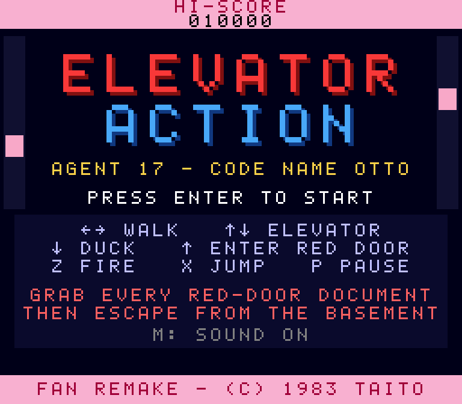
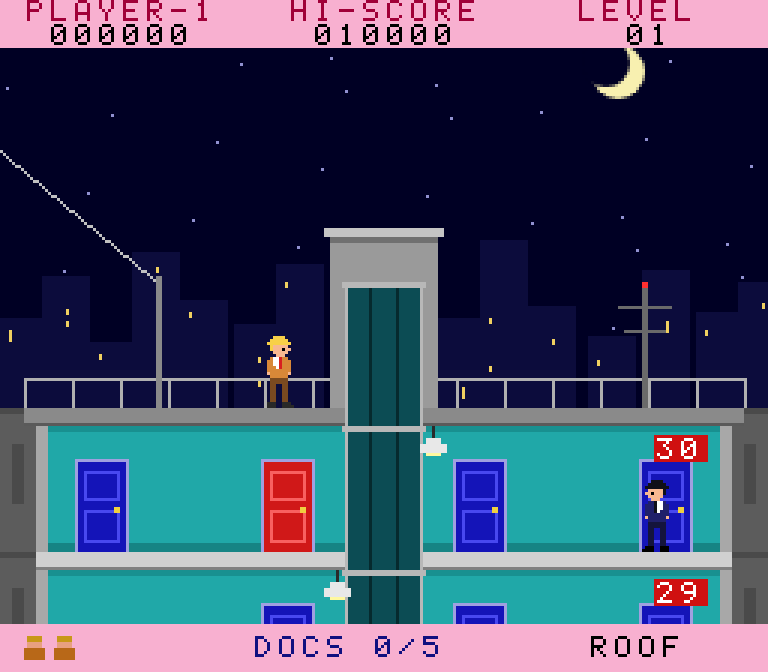
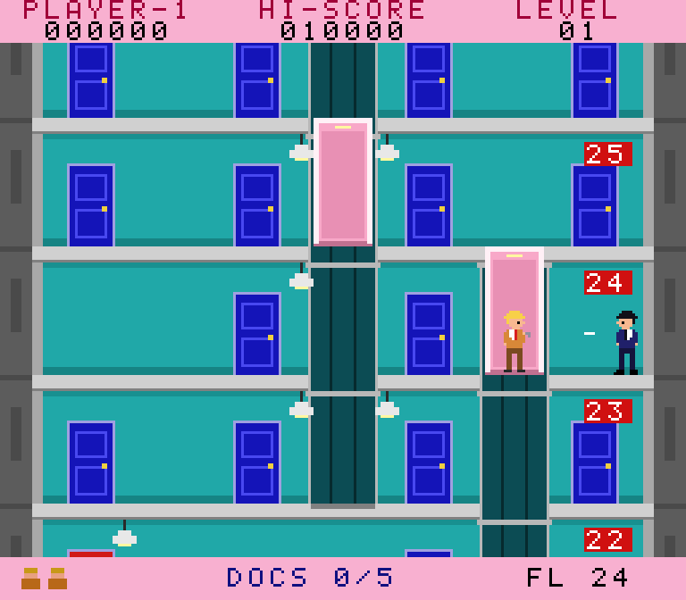
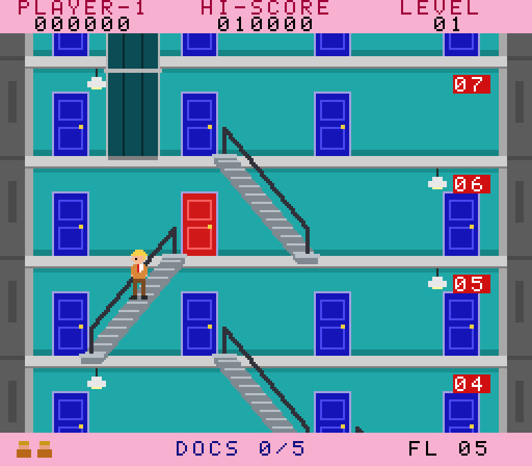

# Elevator Action — Web Remake

An unofficial fan remake of Taito's 1983 arcade classic **Elevator Action**, written from scratch in
TypeScript with a small Canvas 2D engine. It runs at the arcade's native 256×224 resolution, needs no
game framework, and generates every sound in code.

| Title | Rooftop | Elevators | Escalators |
|-------|---------|-----------|------------|
|  |  |  |  |

You play Agent 17, code name "Otto". Ride the zip line onto the roof, work your way down 30 floors
collecting the secret documents behind every **red door**, and escape in the getaway car waiting in the
basement garage.

## How to play

| Action | Keyboard | Gamepad |
|--------|----------|---------|
| Walk | ← → (or A / D) | D-pad / stick |
| Ride an elevator up/down | ↑ ↓ inside the car | D-pad / stick |
| Duck | ↓ | D-pad down |
| Enter a red door | ↑ in front of it | D-pad up |
| Step onto an escalator | ↓ at the top, ↑ at the bottom | D-pad |
| Fire | Z (or J / Space) | A / X |
| Jump / jump-kick | X (or K) | B / Y |
| Start | Enter | Start |
| Pause | P / Esc | Select |
| Mute | M | |

On phones and tablets, on-screen touch controls appear automatically.

### Rules

- Walk into an elevator car when it is level with your floor, then hold ↑ or ↓ to drive it. It always
  stops level with a floor. You can also step onto a car's roof and ride on top of it, but don't let it
  carry you into the top of the shaft.
- Walk into a shaft when the car isn't there and you fall. A drop of about one floor onto a car roof or
  the shaft floor is safe; anything further kills you. The bottom floor of a shaft is solid, but don't
  stand there when a car comes down.
- Enemy agents come out of the blue doors. They fire either **high** (duck under it) or **low** (jump over
  it).
- Take out enemies by shooting them (100), jump-kicking them (150), dropping a ceiling lamp on them (150),
  or crushing them under a descending elevator (300).
- Shooting a lamp (jump and fire) blacks out the building for a moment. Everyone becomes a silhouette
  and enemies struggle to aim.
- Every red door holds a document (500). If you reach the basement without all of them, you are sent
  back up to the highest one you missed.
- Take too long and the **alarm** goes off: enemies spawn faster, move faster, and shoot more often.
- Clearing a building earns a bonus of 1000 × the level number. Each new building has more red doors
  and tougher enemies.
- You get an extra life at 10,000 points, then another every 20,000.

## Development

```bash
npm install
npm run dev        # http://localhost:3000
npm test           # unit + simulation tests (Vitest)
npm run typecheck
npm run build      # production build in dist/
```

The high score and mute setting are saved in `localStorage`. While the game runs, `window.game.debugWorld`
exposes the live simulation for play-testing from the browser console.

## Project layout

```
src/
  main.ts              game loop (fixed 60 Hz), title/play screens, canvas scaling, touch controls
  core/
    rng.ts             seeded PRNG, so buildings and tests are reproducible
    input.ts           keyboard, gamepad and touch input with edge-triggered presses
    audio.ts           Web Audio synthesiser for every sound effect
  sim/                 pure game logic with no DOM access, fully unit-testable
    constants.ts       arcade geometry, tuning and scoring
    building.ts        procedural 30-floor building: shafts, escalators, doors, red doors, lamps
    elevator.ts        elevator car behaviour (automatic shuttle and player-driven)
    world.ts           player, enemies, bullets, lamps, blackout, alarm, scoring, level flow
  render/
    renderer.ts        building, characters, HUD, overlays and title screen
    sprites.ts         pixel-art character frames and palettes
    font.ts            5×7 bitmap font
  tests/               building connectivity, elevator and gameplay scenario tests, random-input fuzzing
```

The building generator chains elevator shafts and escalators from the roof down to the basement, so
every floor is always reachable. The tests check this across hundreds of seeds.

## Credits

Elevator Action is © 1983 Taito Corporation. This is a non-commercial fan project with original code
and artwork, made for learning and fun.
