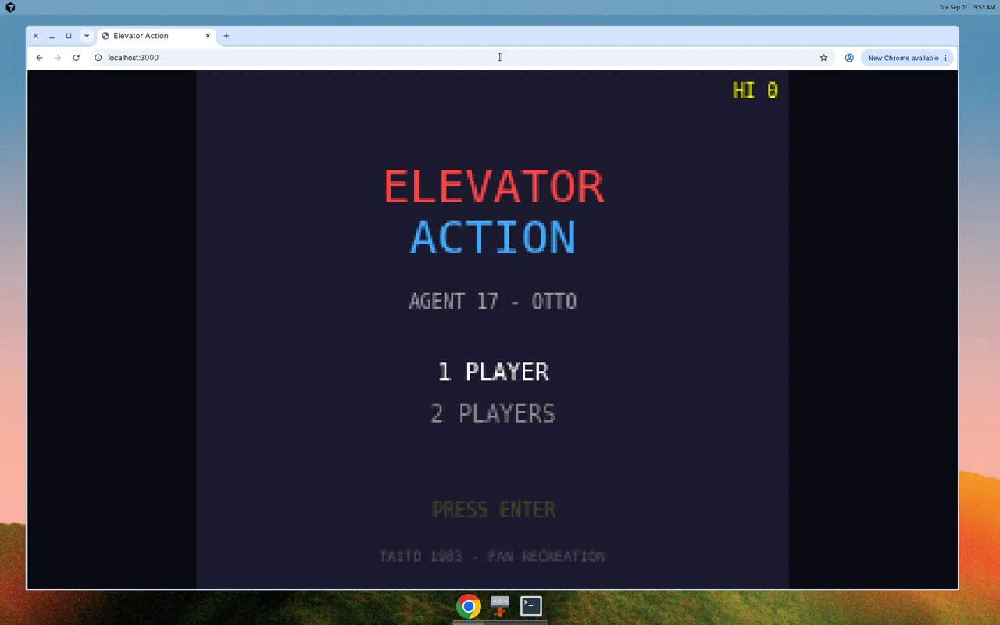

# Elevator Action — Web Recreation

An unofficial fan recreation of Taito's 1983 arcade classic **Elevator Action**, built with TypeScript and Phaser 3.



Play as Agent 17 ("Otto"), infiltrate a 30-story building, collect secret documents from red doors, and escape to your getaway car in the basement.

## Controls

### Player 1
| Key | Action |
|-----|--------|
| Arrow keys | Move / crouch (down) / elevator control (up/down in elevator) |
| Z | Fire |
| X | Jump |
| Enter | Start game (title screen) |

### Player 2
| Key | Action |
|-----|--------|
| WASD | Move / crouch / elevator control |
| G | Fire |
| H | Jump |
| Backspace | Start 2-player game |

## Gameplay

- Collect all **red door** documents before reaching the basement
- Shoot, jump-kick, drop lamps, or crush enemies with elevators
- Floors 15–11 are permanently dark; shooting lamps causes temporary blackout
- Alarm sounds if you take too long — elevators become sluggish and enemies more aggressive
- Extra life at 10,000 points

## Development

```bash
npm install
npm run dev      # http://localhost:3000
npm run build    # production build to dist/
npm test         # run unit tests
```

## Tech Stack

- **Phaser 3** — game engine
- **TypeScript** — type-safe game logic
- **Vite** — dev server and bundler
- **Vitest** — unit tests for level generation and building layout

## Disclaimer

This is an unofficial fan project. Elevator Action is © Taito Corporation. All pixel art and audio are original recreations — no ROM assets are used.
